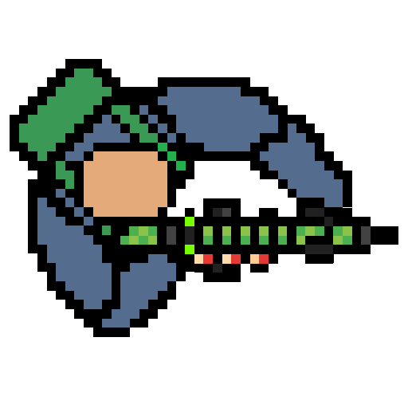

> # Shooter Game v2

###### QuantumGame project



## Мини - описание

just a shooter game

### Controls:

* `WASD` - movement
* `L-CL` - fier
* `Esc` - exit

### Already exist:

- walking
- a variety of weapons, each with its own behavior
- picking up from the floor and throwing on it

### Futures:

- reload
- recoil
- other entities in the scene
- simple physics

## Command on compilation

**with usage pyinstaller:**

```shell
pyinstaller --name "Test Bild" --add-data "C:/Program Files/Python311/Lib/site-packages/toml;toml" --add-data "assets;assets" main.py
```
